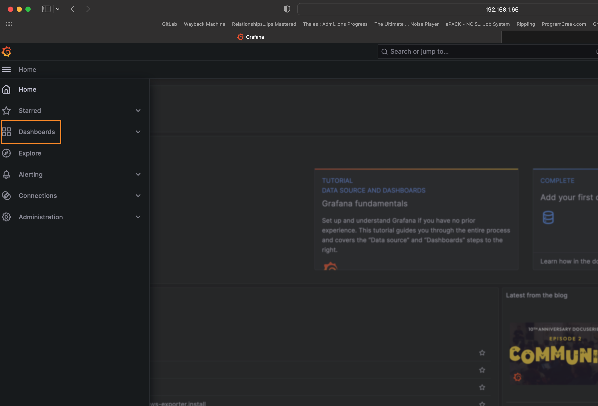
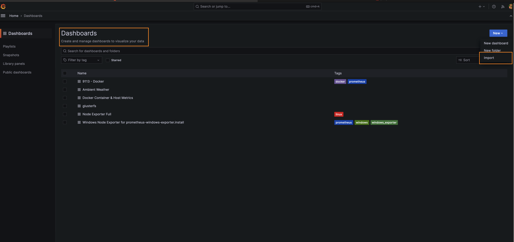
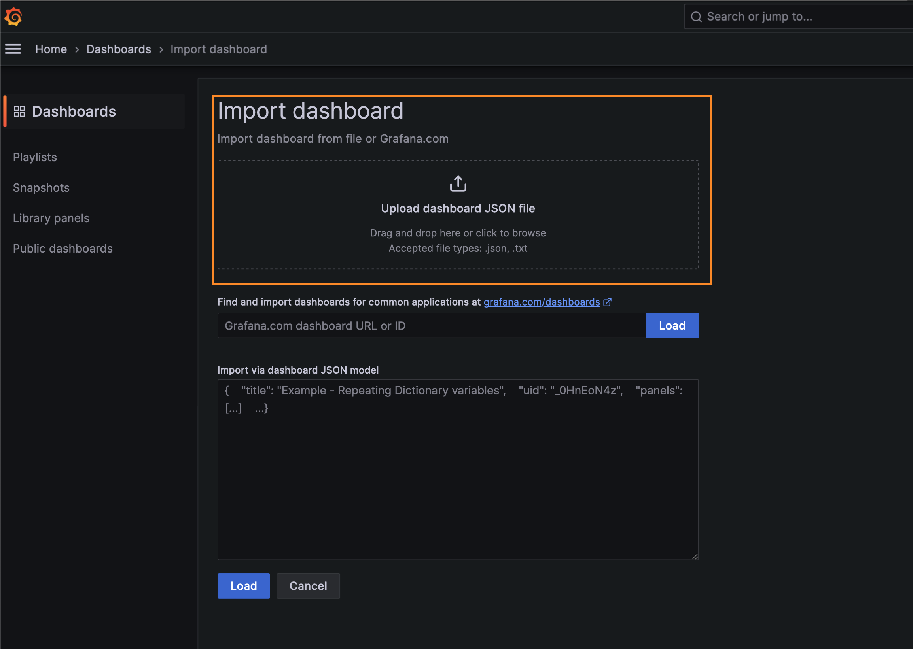

# Grafana Dash

Do the following to import the Grafana dashboard.

1. Clone the git repo.

```bash
# git clone https://github.com/JonathanArrance/AWcollector.git
```

2. Open Grafana and navigate to Dashboards.



3. Click the new button and select *Import*.



4. Navigate to the cloned repo and import the JSON file from the Grafana directory.

